#jenkins是什么

Jenkins 是一个开源项目，提供了一种易于使用的持续集成系统，使开发者从繁杂的集成中解脱出来，专注于更为重要的业务逻辑实现上。同时 Jenkins 能实施监控集成中存在的错误，提供详细的日志文件和提醒功能，还能用图表的形式形象地展示项目构建的趋势和稳定性.

[官方文档](https://jenkins.io/doc/)  [githup地址](https://github.com/jenkinsci)

***

#安装jenkins

jenkins需要java运行环境,需要安装jdk

1. 查看当前的安装版本
```
[root@localhost ~]# rpm -qa|grep java
tzdata-java-2016j-1.el6.noarch
java-1.8.0-openjdk-1.8.0.121-0.b13.el6_8.i686
java-1.8.0-openjdk-headless-1.8.0.121-0.b13.el6_8.i686
```

2. 可以卸载
```
root@localhost ~]# rpm -e --allmatches --nodeps java-1.8.0-openjdk-1.8.0.121-0.b13.el6_8.i686
[root@localhost ~]# rpm -e --allmatches --nodeps tzdata-java-2016j-1.el6.noarch
```

3. 搜索可以jdk版本
`[root@localhost ~]# yum search jdk`

4. 安装jdk
`
[root@localhost ~]# yum install java-1.8.0-openjdk-1.8.0.121-0.b13.el6_8.i686
`
5. 下载jenkins.war
```
[root@localhost ~]# wget https://mirrors.tuna.tsinghua.edu.cn/jenkins/war-stable/2.32.2/jenkins.war
```
6. 运行jenkins
    简单的运行的话,直接
    `java -jar jenkins.war`
    最好是以守护方式运行,我这里使用supervisor,配置如下
    `vim /etc/supervisor.conf`
    
     ```
     [program:jenkins]
     command=java -jar jenkins.war
     autorstart=true
     directory=/root/
     autorestart=true
     startsecs=10
     startretries=36
     redirect_stderr=true 
     user=root                 ; setuid to this UNIX account to run the program
     log_stdout=false            ; if true, log program stdout (default true)
     log_stderr=false             ; if true, log program stderr (def false)
     logfile=/var/log/jenkins.log    ; child log path, use NONE for none; default AUTO
     ;logfile_maxbytes=1MB        ; max # logfile bytes b4 rotation (default 50MB)
     ;logfile_backups=10          ; # of logfile backups (default 10)
     ``` 
     再运行supervisor就可以了
     `service supervisor start`
   
#jenkins的基本使用
  安装完成以后左边的菜单栏是这样的 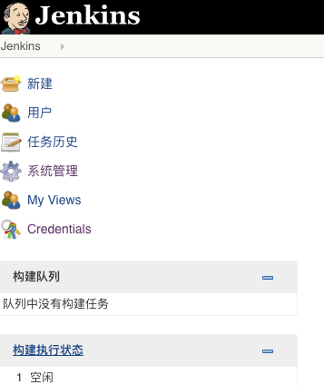

  我们自己可以摸索一下各个功能,关于jenkins的学习资料还是非常多的。
  接下来我的hexo博客使用jenkins来集成
  
#集成hexo博客

1. 准备工作
    1. githup上创建个项目,地址:
    2. 安装[GitHub Plugin](https://wiki.jenkins-ci.org/display/JENKINS/Github+Plugin)插件
    
    在jenkins上的系统管理 >> 插件管理 >>找到Githup Plugin插件安装
    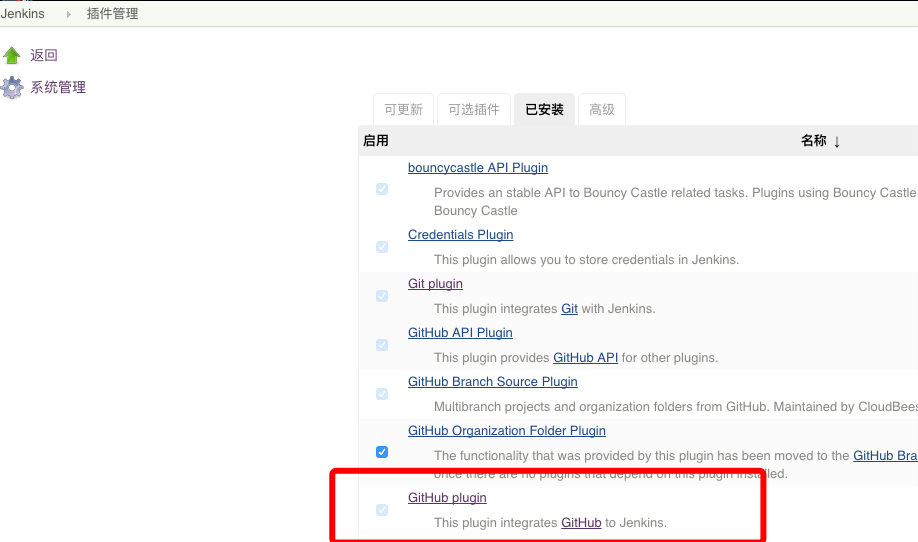
        
    3. 配置[personal access tokens](https://github.com/settings/tokens/new)
    
       在github上用户Settings >> personal access tokens
       
       Github plugin的帮助信息里说要admin:repo_hook、repo和repo:status权限，勾选给Jenkins的访问权限, 然后点击Generate token创建一个token
        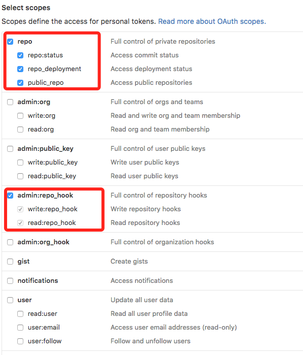 
    4. 配置githup的webhook
    
        在githup上的博客项目上 >> setting >> webhooks
        需要选中选中Just the push event 和ativie项
        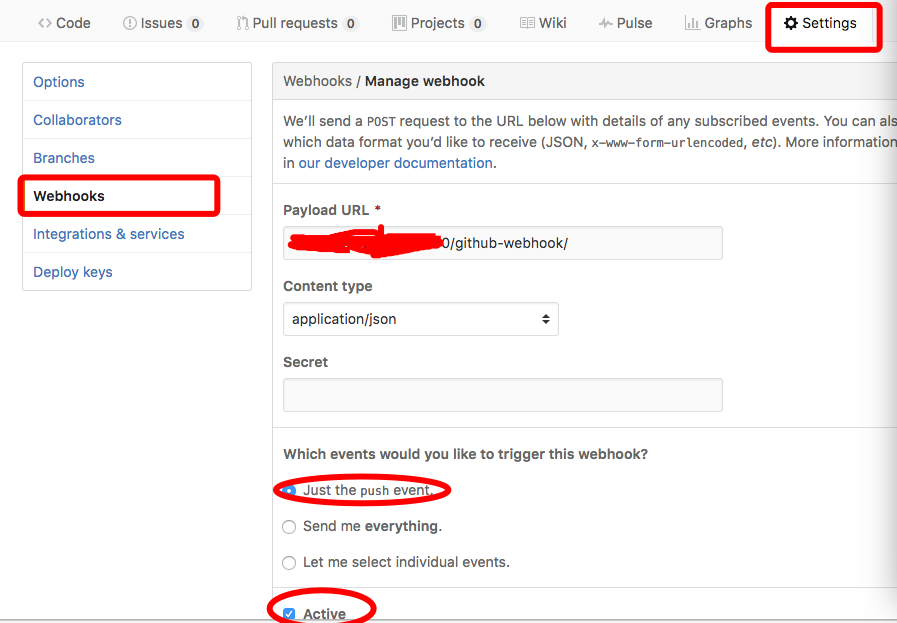 
    5. 添加credentials
        在jenkins上的系统管理 >> 系统设置 >> GitHub >> 添加GitHub server
        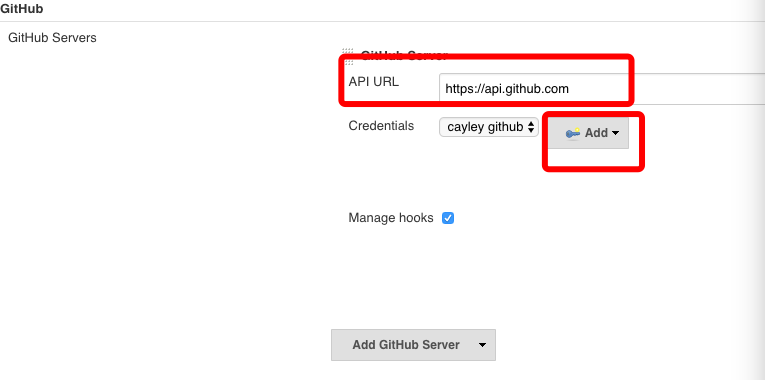
        
         复制上一步的token,回到Jenkins点击Add按钮
         
         
        选择Secret text，粘贴token到Secret项，添加描述(为名称)，点击添加。
        
        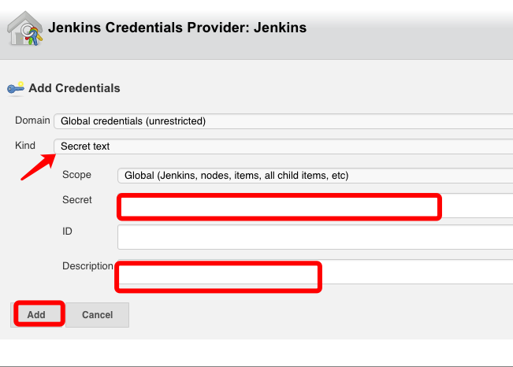
                 
        添加完成后,选择刚刚添加的credentials 点击test connection，如果显示Credentials verified for user ***, rate limit: xxxx，说明配置完成了，
        就这样Jenkins具有访问我的github的权限了。
        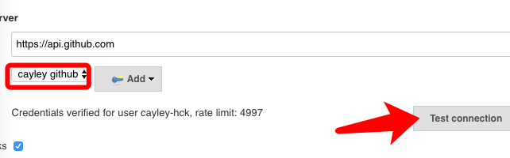
        
2. 创建job

    1. 创建一个名为blog的job
   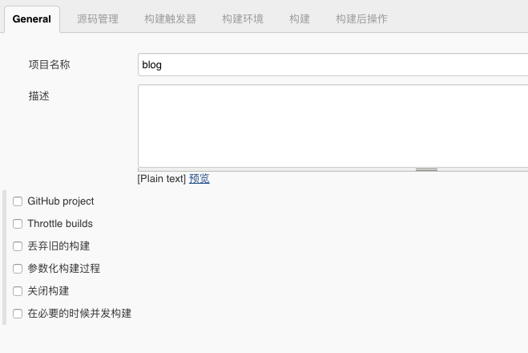
   
   2. 在源码管理中添加git地址
   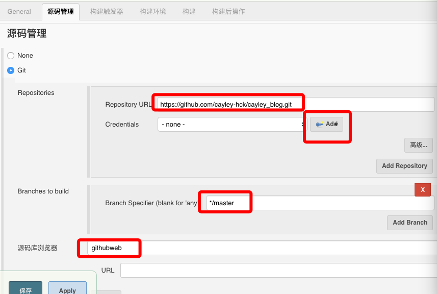
   3. 点击add,添加github的账号 credentials ,Kind项选择Username with password   输入github账号密码
   
        选择githubweb源码库浏览器，这样每次构建都会生成对应的changes，可直接链到github上看变更详情
   
   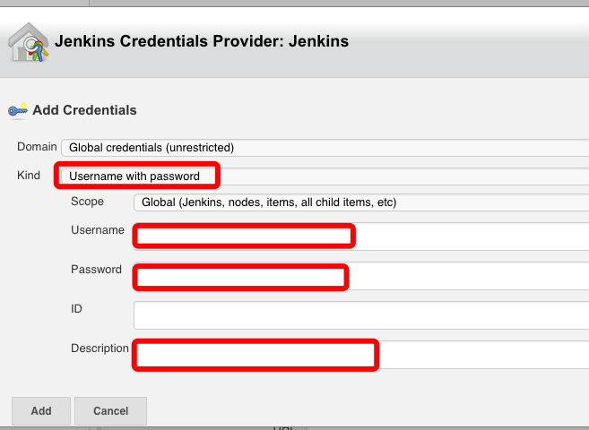
   4. 在构建触发器一项选中GitHub hook trigger for GITScm Polling 表示github上代码更新是自动构建      
   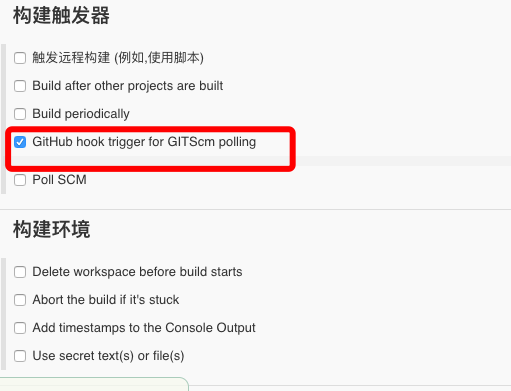
   5. 在构建是设置 构建时同步构建状态到Github 和设置构建执行的shell脚本      
   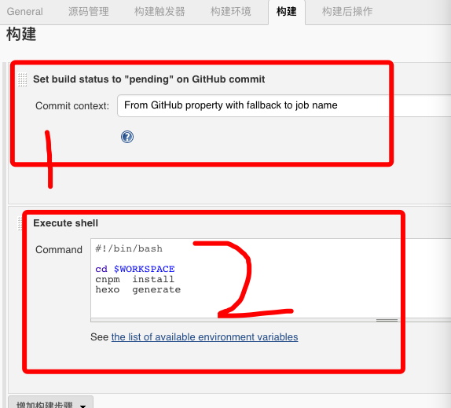
   5. 在构建后操作,设置构建后同步构建状态到Github
   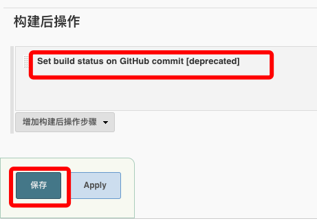
   
   到这里,在jenkins上创建一个基于github的自动化持续集成就完成了
   
3. 果实

   git仓库的每一次push或者pull request都会触发build,也可以通过立即构建按钮来强制build
   
   查看GitHub Hook log 知道github hook 推送信息
   
   查看修改记录,知道代码更新信息
   
   工作空间,可以查看代码
   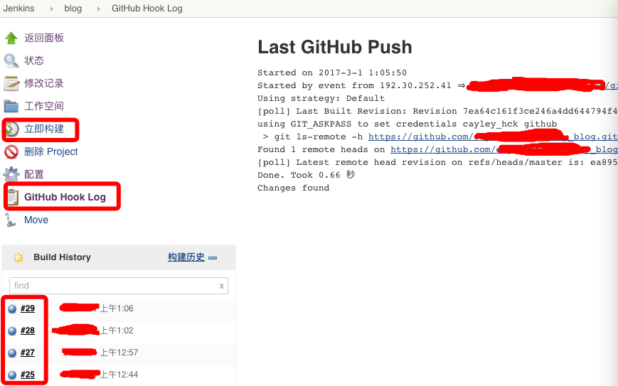
    
#总结
   todo